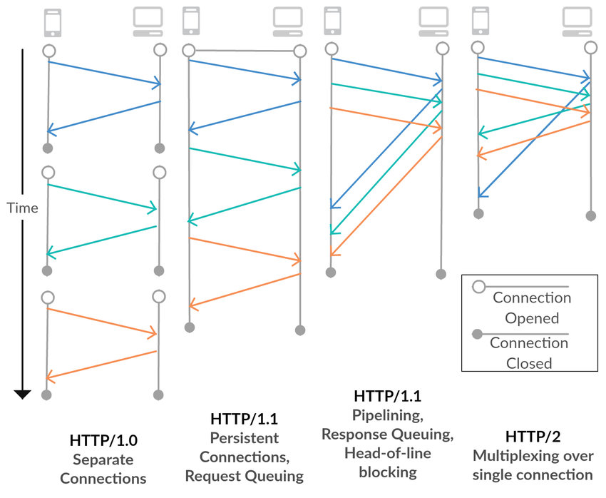

> 1. Difference between Parameter and Argument

A **Parameter** is a variable in the function definition which accepts a value.

```js
function addNumbers(num1, num2) {
  return num1 + num2;
}
//Here num1 and num2 are Parameters
```

An **Argument** is the actual value that is passed to the function when it is called.

```js
addNumbers(3, 6);

//Here 3 and 6 are Arguments
```

> 2.  What is Currying and What it is used for ?

### Currying

_Currying is named after Haskell Curry_

- Currying transform a function with multiple arguments into a sequence of nesting functions.
- In other words, Instead of a function taking all arguments at one time, it takes the first one and returns a new function, which takes the second one and returns a new function, which takes the third one, and so on, until all arguments have been fulfilled.

```js
//Normal function

function sum(a, b, c) {
  return a + b + c;
}
sum(1, 2, 3); // 6
```

```js
//Curried function

function sum(a) {
  return (b) => {
    return (c) => {
      return a + b + c;
    };
  };
}
console.log(sum(1)(2)(3)); // 6
//Or
const sum1 = sum(1);
const sum2 = sum1(2);
const result = sum2(3);
console.log(result); // 6
```

### Uses

- Currying helps you avoid passing the same variable again and again.

```js
const addToFive = sum(5);
const result1 = addToFive(2)(3); // Output: 10

const result2 = addToFive(5)(3); // Output: 13
```

- It helps to create a higher order function.

> 3.  Evolution of HTTP



HTTP 0.9

- HTTP/0.9 was extremely simple: requests consisted of a single line and started with the only possible method GET followed by the path to the resource.
-  Only HTML files could be transmitted.

HTTP 1.0
- HTTP/1.0 introduced the use of headers in requests and responses. It also introduced *POST* method , Content type and Status codes.

- One of the notable drawbacks of HTTP/1.0 is the lack of persistent connections. Each request opens a new connection to the server, and after the response is received, the connection is closed. 

HTTP 1.1
- One of the key enhancements in HTTP/1.1 is the use of persistent connections. 

- HTTP/1.1 supports request pipelining, allowing multiple requests to be sent without waiting for each response. 

- It has Head-of-line blocking issue at application layer as each request should wait for the previous request to be completed for sending their response.

HTTP 2.0
- One of the major improvements in HTTP/2 is multiplexing, which allows multiple requests and responses to be sent concurrently over a single connection but in a single stream. which may lead to Head-of-Line blocking at Transport layer.

- HTTP/2 introduces stream prioritization, allowing the client to assign priority to individual streams. 

HTTP 3.0
- Both HTTP/2 and HTTP/3 support multiplexing, but HTTP/3's implementation is more robust. HTTP/3 allows multiple requests and responses to be sent concurrently over a single connection without the head-of-line blocking issues present in HTTP/2 as HTTP 3.0 send the response in multiple streams(QUIC - Quick UDP Internet Connections).


### <ins>DELETING COMMITS IN GIT

1 . Using 'git reset' command
  - It completely removes the previous commit.
  1. Navigate to the branch where you need to undo a commit
  2. **git reset --hard HEAD^** or **git reset --soft HEAD~1**(delete 1 latest commit) -> To remove the commit
  3. **git push origin <branch-name> --force** -> To update in github also

**--hard** -> Deleted commit will not be in staged changes

**--soft** -> Deleted commit will be in staged changes

2.Using 'git revert' command
 - Creates a new commit to undo changes
  1. Use git log to find the commit hash of the commit you want to revert.
  2. Copy the commit hash.
  3. **git revert commit-hash** -> replace commit-hash with the value you copied
  4. Clck 'commit' and 'Sync Changes'

  ### <ins> FORK IN GIT

By copying the original repository to our personal GitHub account, Git Fork enables us to make changes to the source code without affecting the original repository. where the developer can freely create without concern for the original source code.

- Go to the repository you need to fork
- Click on **fork** on top right corner
- Now you will get clone of the repository in your git account
- Now you can make changes and also you can give pull request to the original repo if the changes has to be commited in original repository.

### <ins>GIT REBASE

Git Merge
 -  When you merge one branch into another, Git creates a new commit that combines the changes from both branches. This new commit represents the merge and has two parent commits, one from each branch.

 Git rebase
 - Instead of creating a new commit, rebase integrates changes by moving or combining commits from the current branch onto the target branch. This results in a linear commit history with a single, continuous line of commits.


