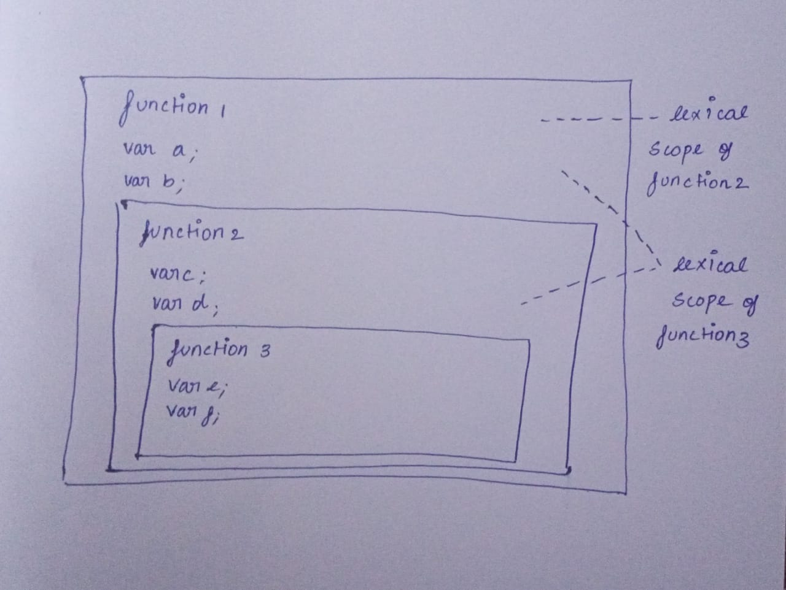

### <ins>TYPES OF DECLARATION</ins>

VAR
 - Can be Redeclared
 - Can be Reassigned

LET
 - Cannot be Redeclared
 - Can be Reassigned

CONST
 - Cannot be Redeclared
 - cannot be Reassigned

 ### <ins>SCOPE OF VARIABLE</ins>

 Scope - ***Lifetime of a Variable***

 >var - Function Scope

 Variables declared with <ins>**var**</ins> inside any function cannot be accessible outside the function

 >let , const - Block Scope

 Variables declared with <ins>**let and const**</ins> inside any block cannot be accessible outside the block.

 ### <ins>LEXICAL SCOPE

 

 A function can access all the variables and methods in its lexical scope.

 >Lexical Scope + Own Scope = Closure

 ### <ins>TYPECASTING/COERTION</ins>

 *Implicit Typecasting*

  When JavaScript automatically converts a value to a different data type based on the context.

```js
var x1 = 3;
var x2 = "5";
console.log(x1 + x2); // Output : "35"
// 3 -> "3"
// "5"
console.log(x1 - x2); // Output : -2
// 3
// "5" -> 5
```
*Explicit Typecasting*

Explicit typecasting is performed manually using built-in methods.

```js
var x1 = 3;
var x2 = "5";
console.log(x1 + parseInt(x2)); //Output : 8
console.log(x1 + +x2); // Output : 8
```
> **NOTE :**   
> "===" is faster than "=="   
> - "==" allows typecasting then compare the values  
> - "===" directly checks the value.
> - In case of comparing array they check the memory location

### <Ins>TYPES OF FUNCTION<Ins>
 - Data Type of function is **'Function'**
 - Function that accepts another function as a parameter is called **"Higher Order Function"** 

 - Functions are First class citizens in JS
 because
   - It can be treated as a value (i.e) Can be assigned to a variable
   - It can be passed to another function as a parameter
   - It can be returned from another function
  
 - **Predicate Function** - Function that return Boolean.


- NORMAL FUNCTION
```js
function double(n) {
  return n * 2;
}
```
- ARROW FUNCTION
```js
const double = (n) => n * 2;
```
- ANONYMOUS FUNCTION
 ```js
 var x= function (){
   return 10;
 }
 x(); //10
 ```
 ```js
 function sum(a) {
  return (b) => {
    return a+b;
  };
}
var result=sum(4);
console.log(result(5)) // 9
 ```

- IIFE - Immediately Invoked Function expression

- Function that is called immediately after it is defined. 

- Used by Library Authors As there will be no name clashes for users.
```js
//Normal IIFE Function
(function double(n) {
  console.log(n * 2);
})(80);

//Anonymous IIFE function
(function (n) {
  console.log(n * 2);
})(80);
```
### <ins>COPY BY VALUE</ins>
 - Using Spread Operator and concat()

```js
// using spread operator
var q1 = [100, 200];
var q7 = [80, ...q1, 300, 400]; // [80, 100, 200, 300, 400]

// using concat();
const a1=[1,2];
const a2=[3,4];
const a3=a1.concat(a2);
console.log(a3);// 1 2 3 4

// Elements inside "const Array" can be changed because array variable only points to the address of first element

const a=[1,2];
a.push(10);
console.log(a); // 1 2 10
```
### <INS>COPY BY REFERENCE

```js
let a1=[10,20];
let a2=a1;

a1.push(30);
a2.push(40);

console.log(a1);// 10 20 30 40
console.log(a2);// 10 20 30 40

// Because a1 and a2 points to same memory location
```
### <ins>DIFFERENT FOR LOOPS

```js
var marks = [40, 9, 80, 0, 30];
```
 - for loop
  ```js
  for (var index = 0; index < marks.length; index++) {
  console.log("index is", index);
  console.log("value is", marks[index]);
}
  ```
 - for...of

 Only accepts array
 ```js
 for (var mark of marks) {
  console.log("mark is", mark);
}
 ```
 - for...in

  Accepts both Array and Oject
 ```js
 for (var index in marks) {
  console.log("index is", index);
  console.log("mark is", marks[index]);
}
 ```
 ### <ins>OBJECT</ins>

 **Object** is a derived datatype
 ```js
 const salaries = {
    esa:100000,
    anbu:80000,
    karti:90000,
 };
 ```
 OBJECT METHODS
```js
 let salaries = {
  John: 100,
  Pete: 300,
  Mary: 250,
};
Object.keys(salaries); // [ "John", "Pete",  "Mary" ]
Object.values(salaries); // [ 100, 300, 250 ]
```
### <INS>ES6 FEATURES

> <ins>1 . `` Template literal
 ```JS
`Welcome ${lastname}, ${firstname} !!!`
```
   - $ { } --> Interpolation    
   - Allow multi-Line String


> <ins>2 . ... Spread operator
  - Used in **"Copy by Value"**
 ><ins>3 . ... Rest operator

 ><ins>4 . Destructuring
  - ARRAY DESTRUCTURING
  ```JS
  const [t1, t2, t3] = [100, 200];
  console.log(t1, t2, t3);
  // Output : 100 200 undefined

  const [t1, t2, t3 = 80] = [100, 200];
  console.log(t1, t2, t3);
  //Output : 100 200 80

  
  const [t1, t2, t3 = 80] = [100, 200 , 500];
  console.log(t1, t2, t3);
  //Output : 100 200 500

  // Default values will be taken only when a variable is undefined
  // In the above example 80 is the Default value

  // using Rest Operator
  const[t1,...t2]=[100,200,300,400];
  console.log(t1);//100
  console.log(t2);//200 300 400

  // Rest Operator should only be used in the last in destructuring.

  ```
 - Holes

    To skip values
   ```js
   const [t1, , t2, t3 = 80] = [100, 200, null];
   console.log(t1, t2, t3); // 100 null 80
   ```

- OBJECT DESTRUCTURING

 ```js
 const { name, networth, power } = {
  name: "Tony Stark",
  house: 10,
  networth: "9C",
  power: 1000,
  phrase: "❤️ you 3000",
};

console.log(name); // "Tony Stark"
console.log(networth); // "9C"
console.log(power); // 1000

// Default value - Similar to Array destructuring
 ```

 ><ins>5 .Arrow function =>

```js
const double = (n) => n * 2;
```

 ><ins>6 . Numeric separators 1_00_00_000
 - For Readability
 ```js
 const num = 1_00_00_00_00;
 ```
 ><ins>7 . Nullish Coalescing ??
 
  - Undefined and null are called bottom values in JS

  - Nullish coaleshing only make "Null and Undefined" into falsy.

 ***Truthy and Falsy***

 When ever there is a condition It expects a boolean. So JS uses type conversion to coerce anything in the condition to be a boolean.

- null
- undefined
- false keyword
- 0
- NaN
- -0
- 0n (Bigint)
- document.all (object)
- "" (Empty String)

Above value is a value that is considered false when encountered in a Boolean context.

```js
console.log("hi" || 1); // hi
console.log(0 || undefined); // undefined
console.log(1|| NaN); //1

// In nullish coaleshing
console.log(0 ?? undefined) //0
```

 ><ins>8 . Optional Chaining ?.

  To avoid Defensive code
   - Defensive code - Code written to avoid errors.
   eg : if-else
 ```js
 const obj={
  name :{
    first : "esa",
    last : "seetha"
  },
  place :{
    city : "tuty"
  }
 };
//without Optional Chaining
console.log(obj.placee.doorno);//error

//With Optional chaining
console.log(obj?.placee?.doorno);// undefined
 ```

 >9 . <ins>Object Short-Hand

  Used Only when Key name and value name are equal.
 ```js
 //Without Object Shorthand
 var foo = {
    x: x,
    y: y,
    z: z,
    a: function() {},
};

// With Object Shorthand
var foo = {x, y, z , a() {}};
 ```


 


